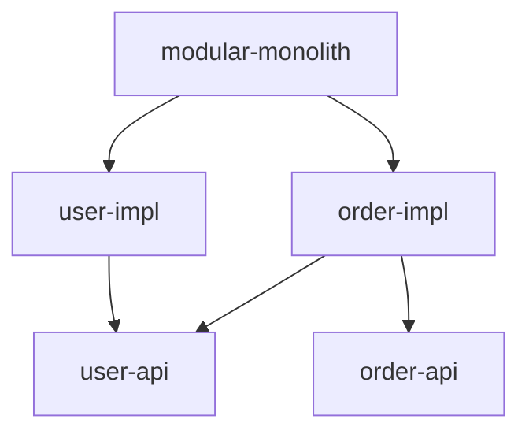

# nestjs-nx-modular-monolith

This is an example of a Modular Monolith web service built using NestJS and NX. This project mostly uses the ideas present in this the series of articles [**How modular can your monolith go?**](https://microservices.io/post/architecture/2023/07/31/how-modular-can-your-monolith-go-part-1.html) by [Chris Richardson](https://microservices.io).

## High Level Architecture

There are two main domains in this project, User and Order. These domains are mostly independent, though they sometimes need to co-operate between themselves. They do this through a well defined interface. Thus, each domain consists of two libraries:

- **api**: this is a library that only exposes interfaces and DTOs. These should change rarely as this is the public API.
- **impl**: this library holds the implementation for the API. It changes way more often.

Right on top, we have our application layer code which mainly does NestJS stuff like bootstrapping the AppModule and configuring IoC. The dependency graph of the project looks like - you can also visualize this by running `npx nx graph`

## Enforcing architecture

The architecture is enforced through automatic checks by using the [`@nx/enforce-module-boundaries`](https://nx.dev/features/enforce-module-boundaries) linting rule. The rules are configured so that:

- implementation modules can only depend on the public API of other modules.
- public API modules can only depend on other modules public APIs.
- all modules can depend on shared modules - which exposes cross cutting concerns.
- shared modules can only depend on other shared modules.

## Scaling

This architecture can easily scale to as many domains as required.
